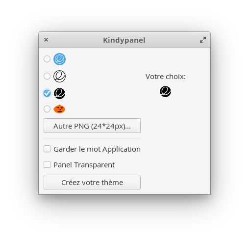

# Kindypanel

# Description

Customisez votre panel à partir du thème basé sur le wingpanel d'elementary :  

- Choisissez un logo pour le coin gauche de votre écran
- Choisissez parmi des icones elementary ou chargez votre propre image (PNG)
- Supprimez ou conservez le nom Application
- Optez si vous le souhaitez pour un panel transparent

Merci à Angedestenebres and Wolfwarrior pour leurs crash-tests  

# Installation rapide (utilisateur)

Télécharger le fichier .deb et lancez  avec votre installateur ou 

 `sudo dpkg -i com.github.lafydev.kindypanel_0.1ubuntu5_amd64.deb`

# Construire et Installer (developpeur)

Télécharger la dernière version (zip) puis extraire les fichier. 

## Dépendances

Ces librairies sont nécessaires à la construction :  

sudo apt-get install gcc valac gtk+-3.0 meson

## Construction

Ouvrir le Terminal dans le répertoire d'extraction, construire votre application et l'installer avec les instructions:  

`meson build --prefix=/usr
cd build
ninja
sudo ninja install`

## Désinstaller

Pour une désinstallation ultérieure conserver le répertoire d'extraction complet.  
Ouvrir le Terminal dans le répertoire précédant ( /build) et lancer la commande :  

`sudo ninja uninstall`
