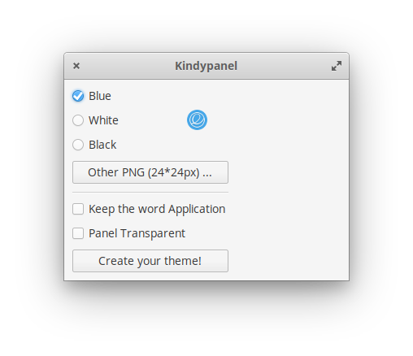

# Kindypanel

 

<h1>Description:</h1>
(En) Create your personalized panel based on elementary's wingpanel :  
<ul>
<li>Add an icon at the top left of the screen</li>
<li>Choose an elementary icon or upload your own image (PNG)</li>
<li>Choose to remove or keep the Application's label</li> 
<li>Choose if you want a transparent panel</li>
</ul>

(Fr) Customisez votre panel à partir du thème basé sur le wingpanel d'elementary :  
<ul>
<li>Choisissez un logo pour le coin gauche de votre écran</li>
<li>Choisissez parmi des icones elementary ou chargez votre propre image (PNG)</li>
<li>Supprimez ou conservez le nom Application</li> 
<li>Optez si vous le souhaitez pour un panel transparent</li>
</ul>

Thanks to Angedestenebres and Wolfwarrior for their crash-tests  

<h1>Easy install (user only) / Installation rapide</h1>

Dowload only the .deb file and run it with your installer. 

 

<h1>Build and install (developper)</h1>

(En) Download the last release (zip) et extract files 
(Fr) Télécharger la dernière version (zip) puis extraire les fichier 

<h2>Dependencies/Dépendances:</h2>
(En) These dependencies are needed for building :  
(Fr) Ces librairies sont nécessaires à la construction :  
<pre>sudo apt-get install gcc valac gtk+-3.0 meson </pre/>

<h2>Build with meson/Construction:</h2>

(En) Open a Terminal in the extracted folder, build your application with meson and install it with ninja: 
(Fr) Ouvrir le Terminal dans le répertoire d'extraction, construire votre application et l'installer avec les instructions: 

<pre>meson build --prefix=/usr
cd build
ninja
sudo ninja install
</pre>

<h2>Uninstall (need the extracted files)</h2>
(En) In the previous folder ( /build) run the command : 
<code>sudo ninja uninstall</code>

(Fr) Pour une désinstallation ultérieure conserver le répertoire d'extraction complet.  
Ouvrir le Terminal dans le répertoire précédant ( /build) et lancer la commande 

