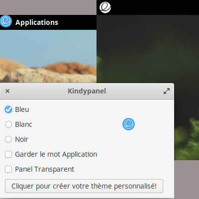

# Kindypanel
<h1>Description:</h1>
Create a personnal theme based on elementary's original wingpanel :  
<ul>
<li>Add an elementary icon at the top left of the screen</li>
<li>Choose to remove or keep the Application's label</li> 
<li>Choose if you want a transparent panel</li>
</ul>

This application is in French, translations are coming soon... 
Thanks to Angedestenebres and Wolfy for their crash-tests  

 

<h1>Manual install </h1>

<h2>Dependencies:</h2>
gcc - valac - gtk3 - meson   

Build with meson: 

Download the last release (zip) et extract files 
Open a Terminal in the extracted folder, install your application with meson: 

<pre>meson build --prefix=/usr
cd build
ninja
sudo ninja install
</pre>

<h1>Uninstall (need the extracted files)</h1>
In the previous folder ( /build) run the command : 
<code>sudo ninja uninstall</code>

