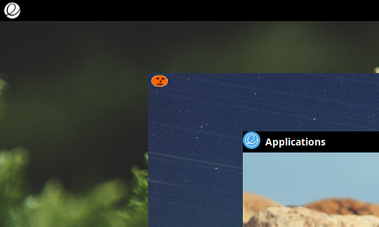
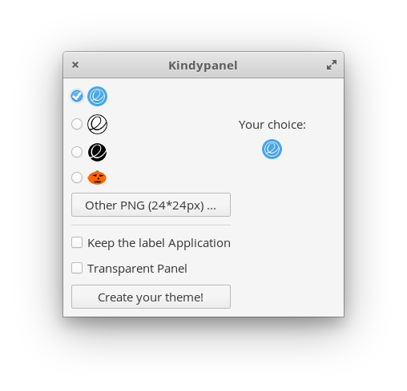

# Kindypanel
<h1>Description:</h1>
Create your personnal panel based on elementary's original wingpanel :  
<ul>
<li>Add an icon at the top left of the screen</li>
<li>Choose an elementary icon or upload your own image (PNG)</li>
<li>Choose to remove or keep the Application's label</li> 
<li>Choose if you want a transparent panel</li>
</ul>

Thanks to Angedestenebres and Wolfwarrior for their crash-tests  

 

<h1>Build and install </h1>

Download the last release (zip) et extract files 

<h2>Dependencies:</h2>
These dependencies are needed for building :  
sudo apt-get install gcc - valac - gtk+-3.0 - meson   

<h2>Build with meson:</h2>

Open a Terminal in the extracted folder, build your application with meson and install it with ninja: 
<pre>meson build --prefix=/usr
cd build
ninja
sudo ninja install
</pre>

<h1>Uninstall (need the extracted files)</h1>
In the previous folder ( /build) run the command : 
<code>sudo ninja uninstall</code>

 

